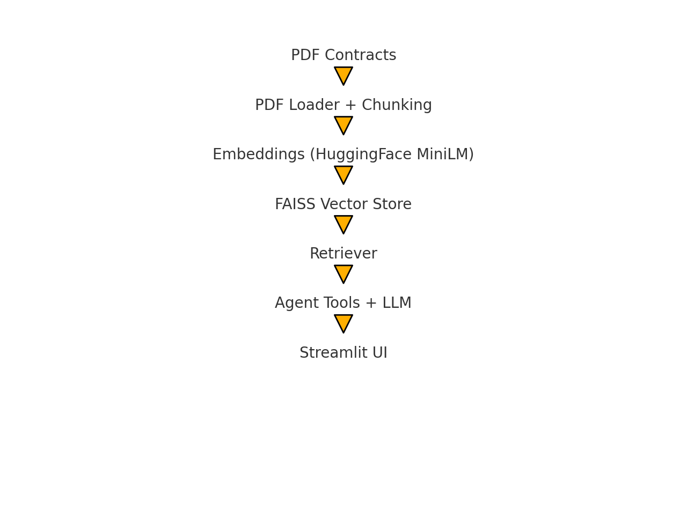

  

---

# Intelligent Contract Assistant (RAG + LangChain)

An end-to-end **Intelligent Contract Assistant** that helps procurement teams query unstructured contract PDFs using **RAG (Retrieval-Augmented Generation)**, **LangChain**, and a simple **Streamlit UI**.

It can answer questions like:

- *“When does Vendor X’s contract auto-renew?”*  
- *“Summarize the SLA terms in this contract.”*  
- *“List all penalty clauses above \$500.”*  
- *“Which contracts have termination notice less than 30 days?”*

---

## Features

**Core (Implemented):**

- ✅ Ingests multiple **PDF contracts** from a folder (`sample_contracts/`)  
- ✅ Extracts text and **chunks** it with overlap (LangChain `RecursiveCharacterTextSplitter`)  
- ✅ Builds a **FAISS** vector index using **HuggingFace sentence-transformer embeddings**  
- ✅ Simple **retriever + tools** pipeline:
  - SLA summarization
  - Renewal clause extraction
  - Penalty extraction (> \$500)
- ✅ **Streamlit UI** to ask questions and see:
  - Final answer
  - Top retrieved passages + source file (provenance)

### Architecture Overview

PDF Contracts → PDF Loader → Text Chunking 
     ↓
Embeddings (HuggingFace MiniLM)
     ↓
FAISS Vector Store
     ↓
Retriever (Semantic search for top-k relevant chunks)
     ↓
Agent Tools (SLA, Renewal, Penalties)
     ↓
LLM (OpenAI or Local)
     ↓
Streamlit UI

### Project Structure

contract_assistant/
│
├── app.py                   # Streamlit UI
├── query_agent.py           # Retriever + tools + LLM orchestration
├── ingest_index.py          # PDF → chunks → embeddings → FAISS index
├── agent_tools.py           # SLA, renewal, penalty extraction logic
├── generate_contracts.py    # Synthetic contract generator (optional)
│
├── sample_contracts/        # 5–10 dummy PDF contracts
├── faiss_index/             # Generated FAISS vector store
│
├── requirements.txt
├── .gitignore
└── README.md                # This file

### Setup

Setup Instructions
## Clone project
git clone https://github.com/Vimala02/contract-assistant.git

## Create virtual environment
cd contract-assistant
python -m venv .pyven
.\.pyven\Scripts\activate

## Install dependencies
pip install -r requirements.txt

## Configure API keys

1. If you use only HuggingFace embeddings and no LLM, no API key is required.

2. If you also use OpenAI LLM for better answers:
    Create an API key in OpenAI platform.
    Create a .env file (not committed to Git):
    # .env
    OPENAI_API_KEY=sk-xxxx...
    Scripts that call load_dotenv() (like ingest_index.py, query_agent.py, app.py) will automatically read it.

Important: Never commit .env or your key to GitHub.

## Generate dummy contracts
python generate_contracts.py

## Build FAISS index
python ingest_index.py
    ### Expected output:
    Loaded docs: 7
    Saved index to faiss_index

## Test in terminal
python query_agent.py
    ### Expected output:
    Example query: When does Vendor X's contract auto-renew?

## Run the Streamlit App
streamlit run app.py
    ### Your UI starts at:
    http://localhost:8501

